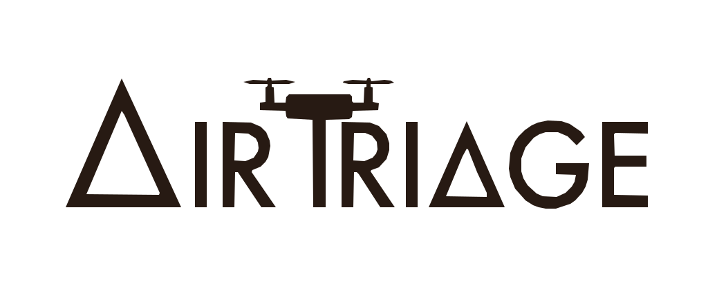

# Air Triage App — Hack Yeah 2026



**AirTriage to oprogramowanie dla ratowników medycznych, które wykorzystuje drony do automatycznego triażu poszkodowanych. System wspiera szybką ocenę ich stanu i ustalanie priorytetów pomocy jeszcze przed dotarciem zespołów ratunkowych — bo w sytuacjach kryzysowych liczy się każda sekunda.**

---

## Konfiguracja

Wymagany Python 3.13 (patrz `.python-version`) i [uv](https://docs.astral.sh/uv/).

```bash
uv sync
```

## Uruchomienie

Otwórz `1_detection_and_movement.ipynb` w katalogu głównym repozytorium i uruchom komórki.
Notebook wczytuje filmy z `data/`, a wyniki zapisuje do `out/`.

Ten sam kod można wywołać bezpośrednio:

```python
from nbutils.tracker import track_speed

track_speed("data/1.mp4", out_path="out/speed_0.mp4", threshold=4.0)
```

## Modele

Wagi detektora leżą w `models/` i **nie są w repozytorium** (`yolov8m.pt` to ok. 50 MB).
Ultralytics pobiera je automatycznie przy pierwszym uruchomieniu, więc po `uv sync` nie trzeba
niczego pobierać ręcznie. Aby użyć innego modelu:

```python
track_speed(..., model_name="models/yolov8n.pt")
```

## Konfiguracja trackera

Parametry trackingu BoT-SORT znajdują się w `tracker.yaml`.

## Struktura repozytorium

| Ścieżka | Zawartość | W git |
| --- | --- | --- |
| `data/` | filmy wejściowe | tak |
| `nbutils/` | detekcja, tracking i przetwarzanie wideo | tak |
| `src/airtriage_hy26_app/` | pakiet aplikacji | tak |
| `tracker.yaml` | konfiguracja trackera BoT-SORT | tak |
| `models/` | wagi YOLO | nie |
| `out/` | filmy z wynikami | nie |
| `runs/` | wyjście Ultralytics | nie |

`.gitignore` pilnuje też `*.pt`, `*.avi`, podglądów `*_preview.webm` w katalogu głównym,
`.venv/` i cache Pythona. Wygenerowane artefakty można bezpiecznie usuwać — zawsze odtwarzane
przez ponowne uruchomienie.

